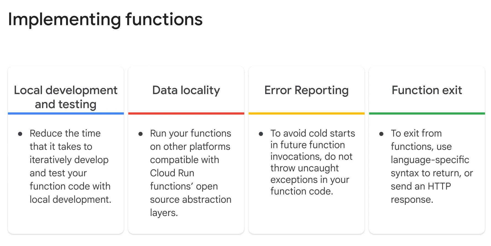

# Comprehensive Notes on Best Practices for Cloud Run Functions

## ONE SENTENCE SUMMARY:
Explore best practices for implementing Cloud Run functions, improving performance, configuring resources, and handling errors and retries.

---

## INTENT:
This document provides practical guidelines and insights to optimize the development, deployment, and maintenance of Cloud Run functions while emphasizing performance, reliability, and security.

---

## STRUCTURED NOTES:

### Best Practices for Function Implementation:
1. **Idempotence:** Ensure functions produce the same result when invoked multiple times to support retries.
2. **Avoid Background Tasks:** Do not execute background activities post-function termination to prevent errors in subsequent invocations.
3. **Handle Errors:** Catch runtime exceptions to avoid cold starts and ensure graceful failure with error logging.
4. **Temporary Files:** Clean up temporary files in memory to avoid resource exhaustion and potential cold starts.
5. **Testing Locally:** Develop and test functions locally to accelerate the testing process and identify issues early.

---

### Performance and Networking Tips:
1. **Cold Start Reduction:** Minimize imported dependencies and initialize global variables only when necessary.
2. **Persistent Connections:** Reuse HTTP connections and Google service clients to save CPU time and prevent quota exhaustion.
3. **Caching:** Use global scope for caching expensive objects like API clients and network connections.
4. **Scaling:** Set minimum instances to reduce cold starts and maximum instances to manage resource constraints.
5. **Concurrency:** Enable concurrency to handle multiple requests per instance while ensuring thread safety.

---

### Error Handling and Retry Mechanisms:
1. **Retry Configuration:** Enable retries for event-driven functions using the `--retry` flag in the CLI or console.
2. **Avoid Infinite Loops:** Use end conditions, such as timestamps, to discard old events and prevent persistent retries.
3. **Appropriate Status Codes:** Return HTTP status codes for errors in HTTP functions and meaningful messages for event-driven functions.

---

### Function Configuration and Security:
1. **Memory and CPU Allocation:** Assign memory and CPU using the `--memory` flag or console settings to optimize function performance.
2. **Timeout Configuration:** Set timeouts slightly higher than the function's execution time to prevent premature termination.
3. **IAM Principles:** Follow the principle of least privilege, restricting access and permissions for functions and service accounts.
4. **Function Identity:** Use user-managed service accounts for better control over function permissions and access.

---

### Function Scaling and Traffic Management:
1. **Scaling Controls:** Configure minimum and maximum instances to balance performance and resource utilization.
2. **Traffic Splitting:** Split traffic between function revisions for gradual rollouts or to revert to prior revisions.
3. **Revision Management:** Revisions are immutable; changes require redeployment, with automatic new revision creation.

---

## MAIN POINTS:
1. Write idempotent functions for safe retries and ensure all operations complete before termination.
2. Reduce cold starts by minimizing dependencies and caching resources in the global scope.
3. Handle runtime errors gracefully and log exceptions to Google Cloud’s Error Reporting for troubleshooting.
4. Configure memory, timeout, and concurrency settings to optimize performance and manage resources.
5. Use IAM and traffic splitting to enhance function security and manage deployment rollouts.

---

## TAKEAWAYS:
1. Adhering to best practices improves function reliability, scalability, and security.
2. Persistent connections and global caching reduce latency and optimize performance.
3. Function retries mitigate transient failures but require proper exception handling to avoid infinite loops.
4. Configurable memory, timeout, and scaling ensure functions align with application needs.
5. Traffic splitting and revision management support controlled deployment and rollback strategies.

---

## KEYWORDS:
- Cloud Run
- Best Practices
- Cold Start
- Persistent Connections
- Error Handling
- Retry Mechanisms
- IAM Principles
- Traffic Splitting
- Function Scaling
- Resource Allocation
