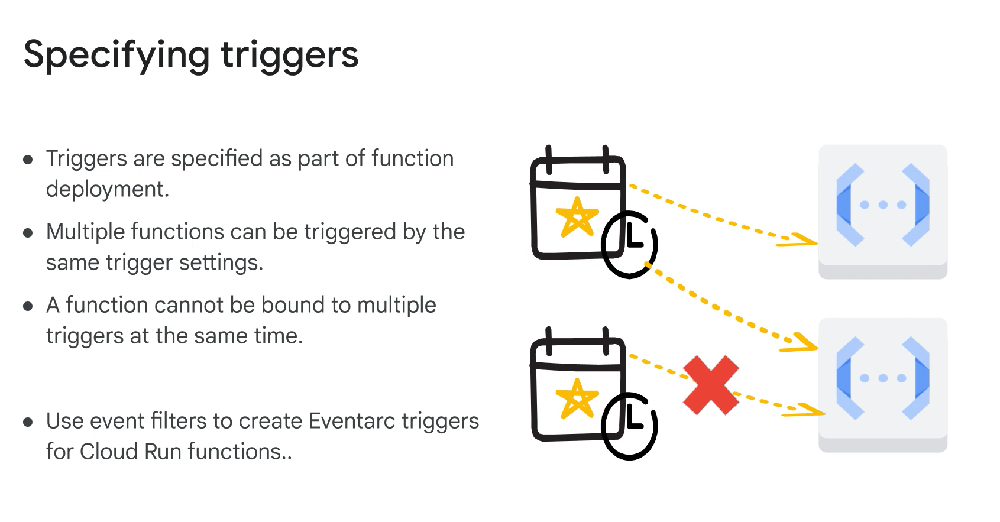

# Study Notes: Cloud Run Function Triggers and Connections

## Module Overview
This module focuses on:
1. **Triggers** for Cloud Run functions and their use in deploying and executing functions.
2. **Connecting Cloud Run functions** to:
   - Virtual Private Cloud (VPC) networks.
   - Workflows and other cloud services.

The module concludes with an optional lab to practice connecting Cloud Run functions to VPC resources.

---

## Understanding Cloud Run Function Triggers

### What are Triggers?
Triggers enable Cloud Run functions to execute in response to specific events or HTTP(S) requests. Each function must have a single trigger specified during deployment, which cannot be shared across multiple triggers.

### Types of Triggers
1. **HTTP Triggers**:
   - Trigger functions via HTTP(S) requests.
   - Assigns an HTTPS URL for function invocation.
   - Supports HTTP methods like `GET`, `POST`, `PUT`, `DELETE`, and `OPTIONS`.

2. **Event Triggers**:
   - Trigger functions in response to events within Google Cloud services.
   - Examples include Pub/Sub messages, Cloud Storage object changes, or Firestore document updates.

---

## Event Triggers in Detail

### Eventarc Integration
All event-driven Cloud Run functions use **Eventarc** for event delivery:
- Eventarc supports 90+ event sources, including:
  - Cloud Audit Logs.
  - External SaaS sources.
  - Custom events via Pub/Sub.

#### Configuring Eventarc Triggers
- Specify event filters like service name, method name, or event type.
- Triggers can be configured via the Google Cloud Console or `gcloud` CLI.

---

### Specific Event Triggers
1. **Pub/Sub Triggers**:
   - Trigger functions when a message is published to a specified Pub/Sub topic.
   - Function types:
     - **CloudEvent Functions**: Receive event data in CloudEvents format.
     - **Background Functions**: Receive event data in `PubsubMessage` format.

2. **Cloud Storage Triggers**:
   - Trigger functions when objects (files) in a Cloud Storage bucket are created, updated, or deleted.
   - Function types:
     - **CloudEvent Functions**: Receive event data in CloudEvents format.
     - **Background Functions**: Receive event data in `StorageObjectData` format.

3. **Firestore Triggers**:
   - Trigger functions in response to document-level changes in Firestore.
   - Supported events:
     - Create, update, delete, and write operations.
   - Function receives a data object with a snapshot of the affected document.

4. **Firebase Triggers**:
   - Supported Firebase services include:
     - Realtime Database.
     - Authentication (1st generation only).
     - Remote Config.
   - Functions handle events from Firebase services within the same Google Cloud project.

---

## HTTP Triggers in Detail

### How HTTP Triggers Work
- Assign an HTTPS URL for each function.
- Ideal for use cases like webhooks or APIs.
- Can handle a variety of HTTP request methods.

### Example Use Cases
- **Cloud Tasks Integration**:
  - HTTP functions can act as task handlers for background processing.
- **Push Notifications**:
  - Use the Gmail Push Notification API to send events to Pub/Sub, consumed by HTTP-triggered functions.

---

## Connecting Cloud Run Functions to VPC Networks

### Overview
Cloud Run functions can connect to resources within Virtual Private Cloud (VPC) networks, enabling secure communication with cloud services hosted on the same network.

#### Benefits:
- Secure, private communication.
- Access to internal cloud resources without exposing them publicly.

---

## Connecting Cloud Run Functions to Workflows

### Overview
Workflows allow you to orchestrate and automate the execution of Cloud Run functions along with other services. You can trigger Cloud Run functions as part of a workflow to create complex, multi-step processes.

#### Example:
- A workflow can start by invoking a Cloud Run function, process the returned data, and then trigger additional services or functions.

---

## Summary of Key Points
1. Cloud Run functions use triggers to define when and how they execute:
   - **HTTP triggers** respond to HTTP requests.
   - **Event triggers** respond to Google Cloud events via Eventarc.
2. Event triggers support multiple event sources, including Pub/Sub, Cloud Storage, Firestore, and Firebase services.
3. Functions can connect securely to VPC networks, enabling private communication with internal resources.
4. Cloud Run functions can be integrated with workflows to build automated processes.

This module provides hands-on experience with these concepts through an optional lab to connect Cloud Run functions to VPC resources.
