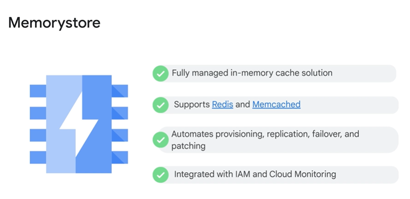
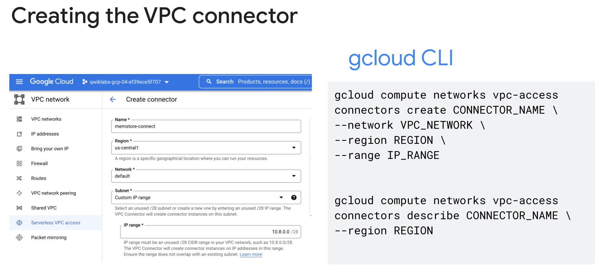
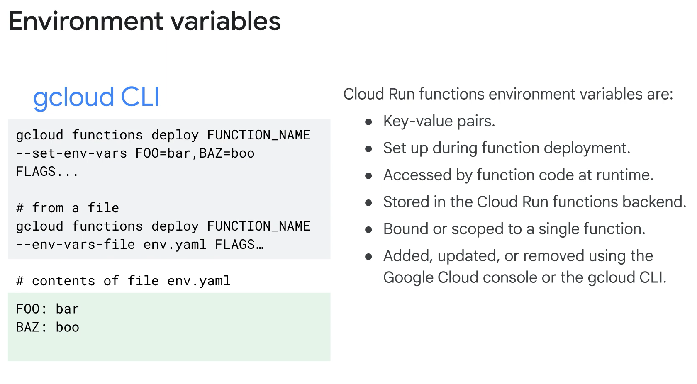
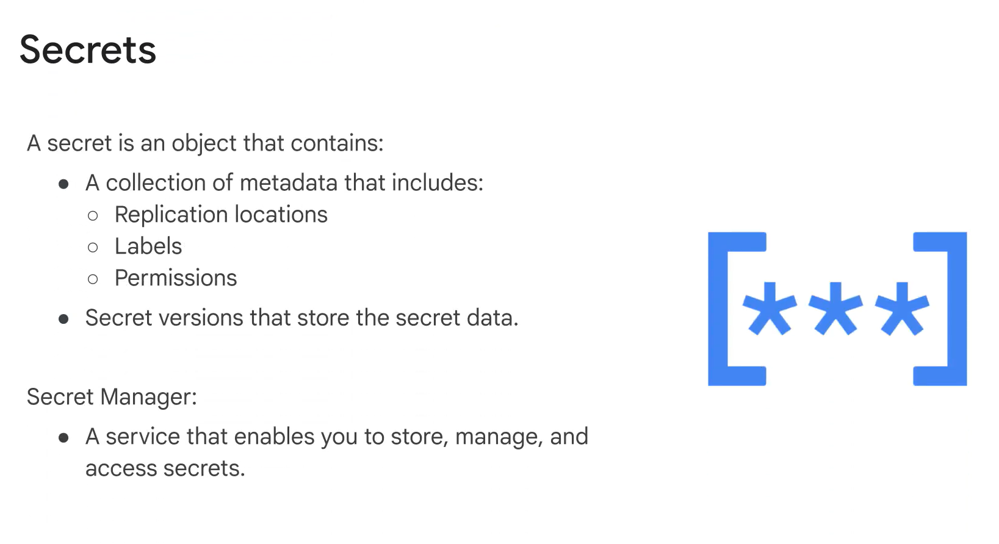
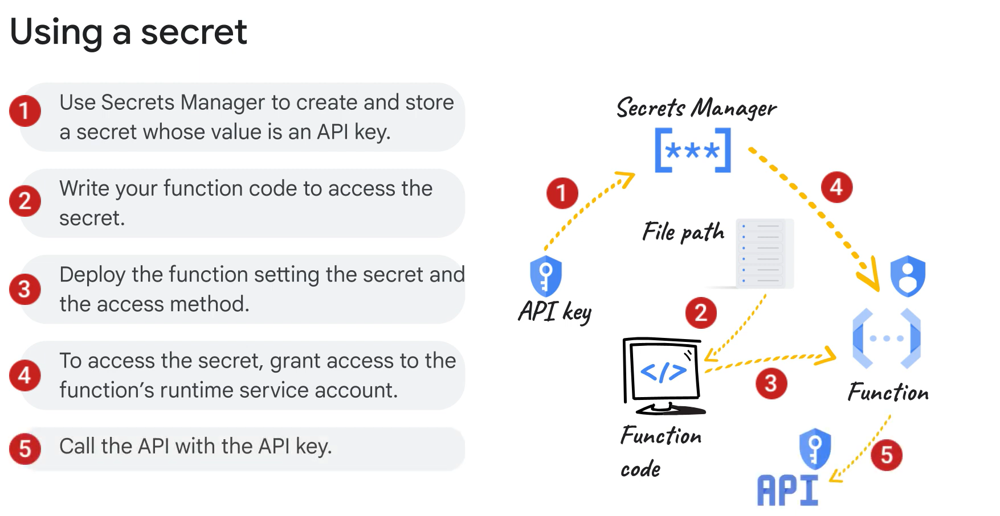

# Comprehensive Notes on Cloud Run Integration and Database Connectivity

## ONE SENTENCE SUMMARY:
Learn how to integrate Cloud Run functions with Google Cloud databases securely using environment variables, Firestore triggers, and Secret Manager.

---

## INTENT:
This document provides a comprehensive tutorial on integrating Cloud Run functions with Google Cloud databases and services, emphasizing security, best practices, and actionable insights.

---

## STRUCTURED NOTES:

### Overview of Cloud Run Integration:
1. **Supported Databases:** Cloud Run functions integrate with Firestore, Memorystore, Cloud SQL, Spanner, Bigtable, and BigQuery.
2. **Key Concepts:** Secure connections, environment variables, Firestore triggers, and use of Google Cloud’s Secret Manager.

---

### Memorystore Integration:

1. **Purpose:** Memorystore is a fully managed, scalable, in-memory cache for Redis and Memcached.
2. **Connection Setup:**
   - Use Serverless VPC Access.
   - Create a connector in the same region as the function.
   - Attach the connector to the Redis instance’s authorized VPC network.
3. **Deployment Requirements:** Specify the connector's path, Redis host IP, and port in environment variables.

---

### Environment Variables:

1. **Definition:** Key-value pairs configured at deployment, accessible during runtime.
2. **Usage:**
   - Configure using `gcloud CLI`, Google Cloud Console, or YAML files.
   - Access them in Python using the `os` module or equivalent runtime-specific methods.

---

### Firestore Integration:
1. **Service Overview:** Firestore is a serverless NoSQL document database with high availability and scalability.
2. **Event Triggers:**
   - Supports document creation, updates, and deletions.
   - Requires specifying document paths and event types.
   - Events expose document snapshot data for function logic.
3. **Implementation Tools:**
   - Cloud Run functions for Firebase SDK.
   - Firestore Native mode is mandatory (not available for Datastore mode).

---

### Secrets Management:

1. **Secret Manager:** Stores sensitive information like API keys and credentials securely.
2. **Access Methods:**
   - Mount as a volume for dynamic access to the latest version.
   - Use environment variables for static version access.
3. **Role Assignment:** Functions require the Secret Accessor role to access secrets.
4. **Cross-Project Access:** Specify the secret’s resource path with project ID and name.

---

## MAIN POINTS:
1. Connect Cloud Run functions to Firestore and Memorystore for seamless database integration.
2. Memorystore provides a fully managed, scalable in-memory cache for Redis and Memcached.
3. Use Serverless VPC Access to connect Cloud Run functions to Redis instances in Memorystore.
4. Environment variables streamline configuration management for Cloud Run function deployments.
5. Firestore triggers enhance server-side logic without requiring dedicated infrastructure.
6. Google Secret Manager protects sensitive data and supports dynamic and static access methods.

---

## TAKEAWAYS:
1. Cloud Run functions allow secure and efficient interactions with various Google Cloud services.
2. Memorystore simplifies integration of Redis and Memcached with managed scaling and security.
3. Firestore triggers enable reactive database logic, enhancing serverless capabilities.
4. Secrets Manager ensures secure handling of credentials and provides flexible access methods.
5. Cloud Run's environment variables provide robust support for deployment and runtime configurations.

---

## KEYWORDS:
- Cloud Run
- Memorystore
- Firestore
- Environment Variables
- Secrets Manager
- Redis
- Serverless VPC Access
- NoSQL
- Event Triggers
- API Keys
