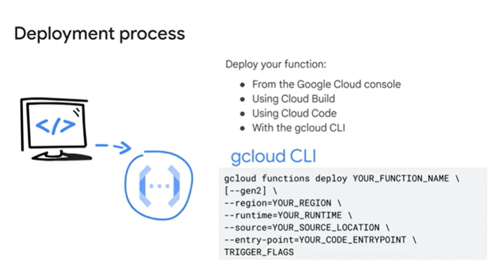
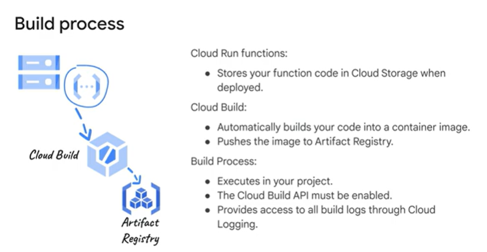

# Study Notes: Building and Deploying Cloud Run Functions

## Overview of Deployment Process

Building and deploying Cloud Run functions involves transforming source code and configuration settings into a runnable image that Cloud Run can execute. This process is fully automated, meaning that Cloud Run manages the image and ensures it handles incoming requests seamlessly.

To deploy Cloud Run functions, you need the appropriate permissions:
1. **Cloud Functions Developer IAM Role**: This role provides the necessary permissions to deploy functions.
2. **Service Account User IAM Role**: This role must be assigned to the runtime service account used by Cloud Run functions.
You can deploy your function using several tools:
- **Google Cloud Console**: A graphical interface for managing cloud resources.
- **Cloud Build**: A service for executing build tasks on Google infrastructure.
- **Cloud Code**: An IDE tool to streamline development and deployment workflows.
- **gcloud CLI**: A command-line tool for interacting with Google Cloud resources.

### Key Deployment Flags
When deploying functions using the `gcloud` CLI, several flags help customize the deployment process:
- `--gen2`: Specifies the use of the second-generation Cloud Run functions platform.
- `--region`: Specifies the geographical region where the function will run.
- `--runtime`: Defines the programming language runtime (e.g., Python, Node.js).
- `--source`: Indicates the location of the function's source code, which can be local, in Cloud Storage, or in a repository.
- `--entry-point`: Specifies the function or class in your source code that serves as the entry point for execution.

### Tools for Deployment
#### Cloud Code
Cloud Code simplifies the deployment of Cloud Run functions by integrating directly into your development environment (IDE). With Cloud Code, you can create, deploy, and test functions without leaving your IDE.

#### gcloud CLI
The `gcloud functions deploy` command provides granular control over deployment, including:
- Trigger type and configuration.
- Source code location.
- Optional use of a `.gcloudignore` file to exclude unnecessary files from deployment.

### Source Code Locations
The `--source` flag specifies where the function’s source code is located:
1. **Local Machine**:
   - Source files are stored on your local system.
   - Use the `--stage-bucket` flag to upload source files to a Cloud Storage bucket during deployment.
2. **Cloud Storage**:
   - The source code is stored in a Cloud Storage bucket, typically as a `.zip` file.
   - Cloud Run functions require appropriate permissions to access the bucket.
3. **Source Repository**:
   - Source code is stored in a repository like GitHub or Bitbucket.
   - Specify a specific revision using `revisions/revision_name` in the repository path.
   - Provide the `Source Repository Reader` role to allow access.

#### Inline Editor in Google Cloud Console
Alternatively, you can write and deploy functions directly in the Google Cloud Console using the inline editor. This editor provides a dual-pane interface:
- Left Pane: View and select source files.
- Right Pane: Edit the selected file.

---

## The Build Process for Cloud Run Functions

When deploying Cloud Run functions, the source code undergoes an automated build process to create a runnable container image. This process leverages several Google Cloud services:

### Step-by-Step Process
1. **Source Code Storage**:
   - The function's source code is first uploaded to a Cloud Storage bucket.
2. **Cloud Build Execution**:
   - Cloud Build automatically compiles the source code into a container image.
   - This image is then stored in **Artifact Registry**, a service for managing software artifacts like container images and language packages.
3. **Execution**:
   - Cloud Run functions access the container image in Artifact Registry to execute the function.

### Cloud Build and Artifact Registry
- **Cloud Build**:
  - Executes builds on Google Cloud’s infrastructure.
  - Automates the containerization process, requiring no manual intervention.
  - Logs are available through Cloud Logging for transparency.
  - Requires the **Cloud Build API** to be enabled in the project.

- **Artifact Registry**:
  - Stores and manages the container images created by Cloud Build.
  - Acts as a central repository for all software artifacts in private, secure repositories.
  - Fully integrates with Cloud Build for seamless artifact management.

### Key Benefits of the Build Process
- **Automation**:
  - The entire process, from source code to deployment-ready container, is automated.
- **Transparency**:
  - Build logs and detailed information are accessible, making debugging easier.
- **Efficiency**:
  - Leveraging Google’s infrastructure ensures quick and reliable builds.

---

## Summary
Deploying Cloud Run functions is a straightforward but powerful process that turns your source code into scalable, serverless functions. The tools and services provided by Google Cloud—such as the Google Cloud Console, Cloud Build, Artifact Registry, and Cloud Code—streamline the development and deployment process. By understanding and leveraging these tools, you can efficiently create and deploy functions to handle a wide variety of use cases in a fully managed environment.
