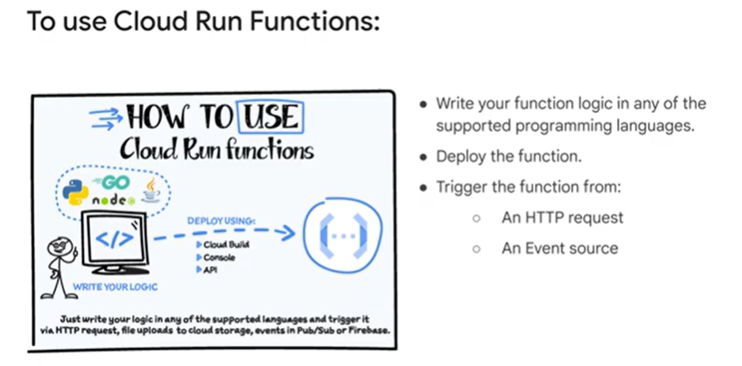
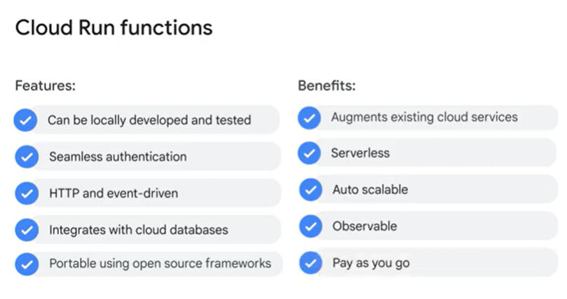
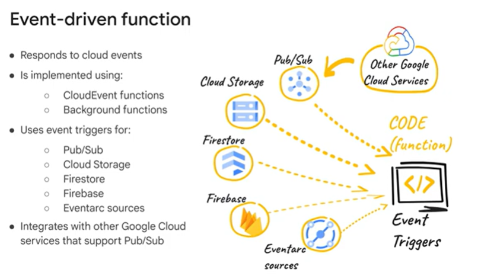
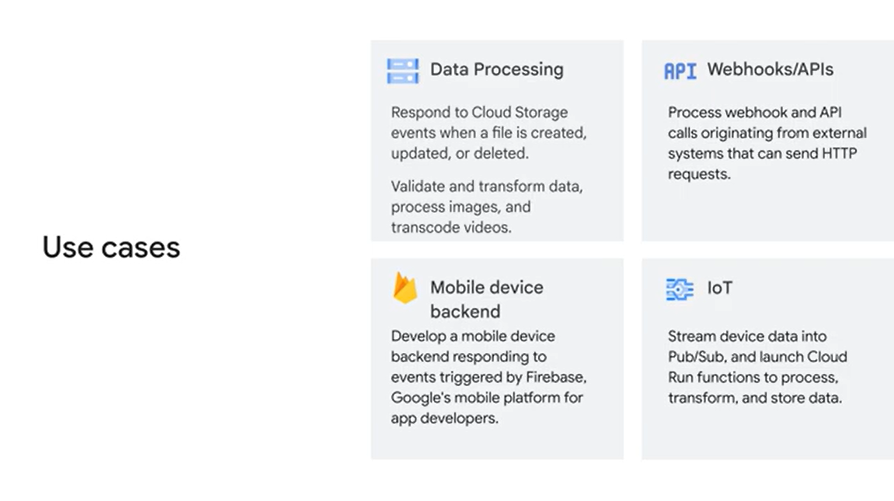

# Study Notes: Cloud Run Functions

## Module Overview
- Introduction to **Cloud Run functions**:
  - Features and benefits.
  - Use cases.
  - Supported language runtimes and regions.
  - Building and deploying functions on Google Cloud.

- Hands-on Lab:
  - Create and deploy a function using:
    - Google Cloud Console.
    - `gcloud` CLI.

## What are Cloud Run Functions?
- **Fully managed serverless environment**:
  - No need to manage infrastructure or servers.
- **Scalable functions-as-a-service**:
  - Triggered via HTTP or events.
  - Integrates with other Google Cloud services (e.g., Pub/Sub, Eventarc).
- **Key Versions**:
  1. **Cloud Run functions** (formerly Cloud Functions 2nd Gen):
     - Functions deployed as services on Cloud Run.
  2. **Cloud Run functions (1st Gen)** (original version):
     - Limited triggers and configurability.

## Features and Benefits
### Features:
1. **Local Development & Testing**:
   - Test functions locally before deployment.
2. **Authentication**:
   - Seamless integration with Google Cloud services via service accounts.
3. **Trigger Types**:
   - HTTP requests and cloud events.
4. **Database Integration**:
   - Supports Cloud SQL, Firestore, Bigtable, and Spanner.
5. **Portability**:
   - Functions run in any supported runtime environment.

### Benefits:
1. **Serverless**:
   - Fully managed by Google.
   - No server provisioning or maintenance.
2. **Autoscaling**:
   - Automatically adjusts resources based on events.
3. **Observability**:
   - Integrated monitoring and logging tools.
4. **Pay-as-you-go Pricing**:
   - Cost based on invocations, runtime, and data transfer.

## Types of Functions
1. **HTTP Functions**:
   - Triggered by HTTP(S) requests.
   - Use cases:
     - Webhooks.
     - APIs.
   - Authentication:
     - Default: Requires authentication.
     - Optional: Allow unauthenticated requests.
2. **Event-Driven Functions**:
   - Triggered by cloud events (e.g., Pub/Sub, Cloud Storage).
   - Use cases:
     - File uploads.
     - Database updates.

## Supported Languages and Runtimes
- Languages:
  - Go, Python, Node.js, Java, .NET Core, Ruby.
- Each runtime has specific directory structures and entry point requirements:
  - **Node.js**: `index.js`, specify main file in `package.json`.
  - **Python**: `main.py`, dependencies in `requirements.txt`.
  - **Go**: Root package with `go.mod`.

## Deploying Functions
### Steps:
1. Develop function code in a supported language.
2. Deploy the function:
   - Google Cloud Console.
   - `gcloud` CLI.
3. Set up triggers:
   - HTTP requests.
   - Cloud events.

### Infrastructure and Regions:
- Functions run in specific regions:
  - Select regions based on latency and proximity to services.
  - Consider availability and cost when using multi-region services.

## Use Cases
1. **Data Processing**:
   - Validate and transform files (e.g., images, videos) from Cloud Storage.
2. **Webhooks and APIs**:
   - Handle HTTP requests from external systems.
3. **Mobile Backends**:
   - Respond to Firebase and Firestore events.
4. **IoT Applications**:
   - Process and store data streamed via Pub/Sub.

## Advanced Features
1. **Scaling and Performance**:
   - Functions can handle up to:
     - 32 GB RAM and 4 vCPUs.
     - 1000 concurrent requests per instance.
   - Runtime limits:
     - HTTP: Up to 60 minutes.
     - Event-driven: Up to 10 minutes.
2. **Revisions**:
   - Deploy new revisions and split traffic between them.
   - Rollback to previous revisions if needed.
3. **Eventarc Integration**:
   - Support for 90+ event sources, custom sources, and Pub/Sub.

For more details, refer to the [Cloud Run functions documentation](https://cloud.google.com/run/docs).
