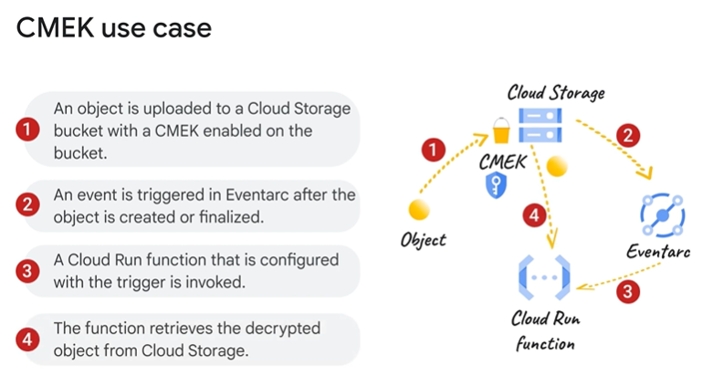

# Study Notes: Protecting Cloud Run Functions and Data

## Overview
Cloud Run functions and their associated data can be protected using **Cloud Key Management Service (KMS)** with **Customer-Managed Encryption Keys (CMEKs)**. CMEKs allow you to:
- Maintain control over the encryption keys.
- Secure data at rest, ensuring no unauthorized access.

### What are CMEKs?
- CMEKs are encryption keys managed by you, not Google.
- They can be stored as:
  - **Software keys**.
  - **HSM (Hardware Security Module) keys**.
  - **Externally managed keys**.
- If a CMEK is disabled or destroyed, access to protected data becomes impossible, even for the owner.

---

## Data Protected by CMEKs
When you deploy a Cloud Run function with a CMEK, the following data is encrypted:
1. **Function Source Code**:
   - Uploaded for deployment and stored in Cloud Storage.
   - Used during the build process.
2. **Build Process Results**:
   - Includes container images built from source code.
   - Each deployed instance of the function.
3. **Internal Event Transport Data**:
   - Data at rest for event communication channels.

---

## Setting Up CMEK for Cloud Run Functions

### Step 1: Create an Encryption Key
- Create a **single-region encryption key** in Cloud KMS to ensure compatibility with Cloud Run.

### Step 2: Enable CMEK for Artifact Registry
- Create an Artifact Registry repository with CMEK enabled.
- Use the same key for:
  - The Artifact Registry repository.
  - Enabling CMEK on the Cloud Run function.

### Step 3: Grant Permissions to Service Accounts
- Grant the following service accounts access to the encryption key:
  - **Cloud Run Functions Service Agent**.
  - **Artifact Registry Service Agent**.
  - **Cloud Storage Service Agent**.
- Assign the **Cloud KMS CryptoKey Encrypter/Decrypter** role to these accounts.

### Step 4: Enable CMEK for the Function
- Deploy the Cloud Run function and specify:
  - The encryption key.
  - The CMEK-enabled Artifact Registry repository.

---

## CMEK Use Case Example: Cloud Storage Integration

1. **Encrypting Objects**:
   - Use CMEKs to encrypt individual objects or configure a Cloud Storage bucket to use CMEK by default for all new objects.
   - Encrypted objects are stored securely in the bucket.

2. **Triggering Functions**:
   - A Cloud Run function can be triggered via Eventarc when changes occur in the Cloud Storage bucket (e.g., object upload).
   - The function can retrieve and decrypt objects for processing.

3. **Custom Encryption Function**:
   - A function can encrypt individual objects before uploading them to Cloud Storage.

### Permissions for Cloud Storage Integration
- Grant the **Cloud Storage service account** or **service agent** access to the encryption key by:
  - Adding the service account as a principal of the key.
  - Assigning the **Cloud KMS CryptoKey Encrypter/Decrypter** role.

---

## CMEK Behavior and Key Lifecycle

### Key Usage
- Cloud Run functions use the **primary version** of the specified encryption key.
- It is not possible to select a specific key version for a function.

### Key Disabling or Destruction
1. **Active Function Instances**:
   - Existing instances of functions protected by the key continue to run without interruption.
2. **New Executions**:
   - Fail if the function requires access to the disabled or destroyed key.
   - Any new instances required for execution will fail.

---

## Summary
- **Customer-Managed Encryption Keys (CMEKs)** provide enhanced security for Cloud Run functions and their associated data.
- CMEKs enable you to retain control over encryption while protecting critical data, such as:
  - Function source code.
  - Container images.
  - Event transport data.
- Configuring CMEK involves enabling encryption for Artifact Registry and granting appropriate permissions to service accounts.
- If a CMEK is disabled, all new executions of associated functions fail, ensuring data remains inaccessible.

For more details, refer to:
- [Cloud KMS Documentation](https://cloud.google.com/kms/docs).
- [CMEK for Cloud Run Functions](https://cloud.google.com/run/docs/securing-cmek).
