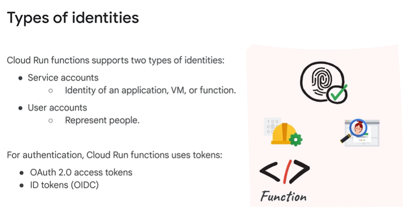

# Study Notes: Securing Cloud Run Functions

## Overview
This module focuses on securing Cloud Run functions using:
1. **Identity-based access controls**.
2. **Network-based access controls**.
3. **Encryption** to protect data and functions.

You will learn:
- How to authenticate and authorize access to functions.
- Best practices for securing Cloud Run functions and their associated data.

---

## Securing Access to Cloud Run Functions

### Access Controls
Cloud Run functions can be secured using:
1. **Identity-based access controls**:
   - Validates the identity of the requestor.
   - Determines the permissions based on the identity.
2. **Network-based access controls**:
   - Restricts ingress (incoming) and egress (outgoing) network traffic.

---

### Identity-Based Access Controls

#### Authentication
Authentication ensures that the requestor is who they claim to be. Cloud Run functions support two types of identities:
1. **Service Accounts**:
   - Used by non-human entities (e.g., functions, applications, VMs).
2. **User Accounts**:
   - Represents individuals (Google Account holders or members of Google Groups).

Clients authenticate by generating **tokens**, which are included in requests. These tokens:
- Are short-lived.
- Minimize the risk of credential leakage.
- Use the OAuth 2.0 framework and OpenID Connect (OIDC).

#### Authorization
After authentication, the system checks the permissions associated with the identity to authorize access. Cloud Run functions use **Identity and Access Management (IAM)** for this purpose:
- IAM roles group individual permissions.
- Roles define what actions an identity can perform on the function.

#### Predefined Roles
- **Cloud Functions Admin**: Full administrative access.
- **Cloud Functions Developer**: Create and update functions.
- **Cloud Functions Invoker**: Invoke functions.
- **Cloud Functions Viewer**: View function metadata.

To authorize access:
- Use the Google Cloud Console or `gcloud` CLI.
- Assign appropriate roles to user accounts or service accounts.

---

### Token Types
Cloud Run functions use two types of tokens:
1. **OAuth 2.0 Access Tokens**:
   - Authenticate API calls.
2. **ID Tokens**:
   - Authenticate calls to custom application code (e.g., one function calling another).

When a function calls another function:
- Grant the **Cloud Run Invoker** role to the calling function’s service account.
- Generate an ID token with the audience (`aud`) field set to the receiving function’s URL.
- Include the token in the `Authorization` header.

---

### Runtime Service Accounts
Every Cloud Run function has an associated **runtime service account** for accessing other Google Cloud resources. 
- **Default Service Account**:
  - Used during development and testing.
  - **Not recommended for production**.
- **Custom Service Accounts**:
  - Specify during deployment.
  - Grant minimal permissions needed for the function’s purpose.

Best Practices:
- Assign specific roles to the runtime service account.
- Restrict permissions to only necessary resources.

---

## Network-Based Access Controls

### Ingress Settings
Ingress settings control which sources can invoke a function:
- **Allow all traffic**: No restrictions.
- **Allow internal traffic only**: Restricts access to resources within the same project or VPC Service Controls perimeter.
- **Allow internal traffic and traffic from Cloud Load Balancing**: Enables access via internal Google Cloud resources and load balancers.

### Egress Settings
Egress settings manage outbound HTTP requests:
- Functions must be connected to a **VPC network** using a **Serverless VPC Access connector**.
- Egress options:
  - Route all traffic through the connector.
  - Route only private IP traffic through the connector.

---

### Serverless VPC Access
Serverless VPC Access enables secure communication between Cloud Run functions and VPC networks, allowing access to:
- **Compute Engine VMs**.
- **Memorystore**.
- Other resources with private IP addresses.

#### Configuration Steps:
1. **Enable the Serverless VPC Access API**.
2. **Create a VPC Access Connector**:
   - Assign to a specific VPC network and region.
   - Configure a dedicated subnet or CIDR range for the connector.
3. **Attach Connector to Functions**:
   - Specify the connector in function settings using the Google Cloud Console or `gcloud` CLI.
4. **Restrict Access**:
   - Use firewall rules to control resource access.
   - Support shared VPC networks.

---

### VPC Service Controls
**VPC Service Controls** add an additional layer of security by creating a service perimeter around Cloud Run functions.

#### Configuration Steps:
1. Create a **service perimeter** and add projects to it.
2. Configure **organization policies** to enforce security rules:
   - HTTP functions only accept traffic from within the perimeter.
   - All functions must use a **Serverless VPC Access connector**.
   - All outbound traffic must route through the VPC network.

---

## Protecting Data with Encryption

### Encryption Keys
Cloud Run functions and their data are automatically encrypted:
- Managed encryption keys provided by Google Cloud.
- Optionally, use **customer-managed encryption keys (CMEKs)** for greater control.

Best Practices:
- Use CMEKs for sensitive workloads.
- Regularly rotate encryption keys.

---

##
