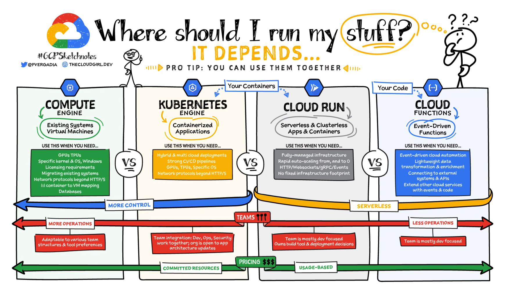
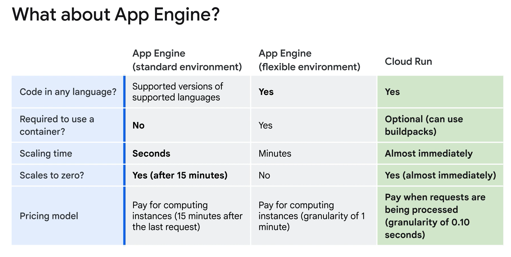

# Comparison of Google Cloud Platforms

#### Introduction
When deciding where to run your applications on Google Cloud, it is important to consider the level of control you need over the infrastructure, the nature of your application, the operational burden, team structure, and cost. Each Google Cloud platform offers unique strengths suited to different use cases.

### Key Platforms

1. **Compute Engine**
2. **Google Kubernetes Engine (GKE)**
3. **Cloud Run**
4. **Cloud Functions**
5. **App Engine**

---

### **Compute Engine**

#### Overview
Compute Engine provides high-performance virtual machines (VMs) that allow you to lift-and-shift legacy systems to the cloud, run specific licensed software, and customize the hardware and operating system. It offers the most control but requires significant operational effort.

#### Features
- **Predefined and Custom Machine Types**: Choose from a variety of machine configurations or create custom VMs tailored to your needs.
- **Persistent Disks and Local SSDs**: Attach scalable storage options that can grow with your application's needs.
- **Preemptible VMs**: Cost-effective VMs for batch jobs that can handle interruptions, available at a discount.
- **Operating System Flexibility**: Run a wide range of OS options, including various Linux distributions and Windows.
- **Control Over Updates and Patching**: You manage OS and software updates, ensuring your system meets specific requirements.

#### Use Cases
- **Lift-and-Shift**: Migrating on-premises applications to the cloud without changes.
- **Custom Applications**: Applications requiring specific OS or hardware configurations.
- **High Control Environments**: Scenarios where maximum control over the infrastructure is needed.

---

### **Google Kubernetes Engine (GKE)**

#### Overview
GKE is a managed Kubernetes service that simplifies running containerized applications. It offers a balance of control and operational efficiency, making it suitable for modernizing applications and managing hybrid cloud environments.

#### Features
- **Managed Kubernetes**: Google manages the control plane, scaling, patching, and monitoring, reducing operational overhead.
- **Cluster Management**: Control over node provisioning, maintenance, and lifecycle.
- **GKE Autopilot**: Fully managed clusters where Google handles infrastructure management.
- **Scalability**: Both workload and cluster scaling capabilities.
- **Integration with Google Cloud Services**: Seamless integration with Cloud Build, Artifact Registry, IAM, VPCs, and more.

#### Use Cases
- **Containerized Applications**: Ideal for running Docker containers in hybrid or multi-cloud environments.
- **Microservices Architectures**: Applications with microservices that need orchestration and scalability.
- **High Control and Flexibility**: Applications requiring GPUs, TPUs, or non-HTTP protocols.

---

### **Cloud Run**

#### Overview
Cloud Run is a fully managed serverless platform for running stateless containers. It abstracts infrastructure management, providing automatic scaling and pay-per-use pricing.

#### Features
- **Serverless Containers**: Run any stateless containerized application.
- **Automatic Scaling**: Scales up and down based on demand, down to zero during inactivity.
- **Flexible Deployment**: Support for container-based or source-based deployment workflows.
- **Buildpacks**: Automatically build secure container images from source code.
- **HTTP(S) Endpoints**: Each deployed container gets a unique URL for handling requests.

#### Use Cases
- **Web Applications and APIs**: Hosting scalable web services.
- **Data Processing**: Cost-effective data processing jobs that only run when needed.
- **Event-Driven Applications**: Integrations with Pub/Sub and Eventarc for reactive workflows.

---

### **Cloud Functions**

#### Overview
Cloud Functions is a serverless execution environment for running lightweight, event-driven functions. It allows for easy integration with Google Cloud services and external APIs.

#### Features
- **Event-Driven Execution**: Triggered by events from various Google Cloud services.
- **Automatic Scaling**: Functions scale based on the number of events.
- **Multi-Language Support**: Supports Node.js, Python, Go, Java, .NET, Ruby, and PHP.
- **Focus on Code**: Simplifies development by abstracting infrastructure management.

#### Use Cases
- **ETL Operations**: Lightweight data extraction, transformation, and loading.
- **Message Processing**: Handling messages from Pub/Sub topics.
- **Webhooks**: Integrating with third-party services via HTTP triggers.
- **Microservices**: Small, stateless services that respond to events.

---

### **App Engine**

#### Overview
App Engine is a fully managed serverless platform for building and deploying scalable web applications. It offers both standard and flexible environments.

#### Features
- **Standard Environment**: Runs code in a sandbox with automatic scaling. Supports specific versions of programming languages.
- **Flexible Environment**: Requires custom containers but offers more flexibility with language and library choices.
- **Scaling and Pricing**: Standard environment scales to zero, while the flexible environment is better for sustained traffic but does not scale to zero.

#### Use Cases
- **Web Applications and APIs**: Ideal for building scalable web services with low latency.
- **Non-Containerized Applications**: Applications that do not need custom containers.
- **Spiky Traffic**: Applications that experience irregular traffic patterns.

---

### **Comparison and Decision-Making**

#### Control vs. Operational Effort
- **Compute Engine**: Maximum control, high operational effort.
- **GKE**: Balance of control and operational efficiency.
- **Cloud Run & Cloud Functions**: Minimal operational burden, focus on application logic.
- **App Engine**: Serverless with varying degrees of control depending on the environment.

#### Team Structure
- **Developer-Focused Teams**: Cloud Run and Cloud Functions for ease of development and deployment.
- **Mixed Teams (Developers and Ops)**: GKE for hybrid systems and more control over workloads.
- **Legacy Applications**: Compute Engine for VMs migrated from on-premises environments.

#### Pricing
- **Compute Engine & GKE**: Based on VM usage, predictable costs.
- **Cloud Run & Cloud Functions**: Pay-per-use, cost-effective for variable traffic patterns.
- **App Engine**: Depends on the environment, pay for active instances.

### Final Thoughts

Choosing the right platform depends on the specific requirements of your application, your team's structure, and your operational capabilities. Google Cloud provides flexible options that allow you to focus on application development while managing the necessary infrastructure. 

- **Start with Serverless**: If you do not have complex infrastructure requirements, begin with a serverless platform like Cloud Run or Cloud Functions.
- **Move to More Control**: As your application grows or needs more control, consider transitioning to GKE or Compute Engine.

By leveraging the strengths of each platform, you can build, deploy, and scale your applications efficiently on Google Cloud.

---

### Summary

In this comparison, we explored Google Cloud's Compute Engine, Google Kubernetes Engine (GKE), Cloud Run, Cloud Functions, and App Engine. Each platform offers unique strengths suited to different use cases. Compute Engine provides maximum control, while GKE offers a balance of control and operational efficiency. Cloud Run and Cloud Functions minimize operational burden with serverless environments, ideal for stateless and event-driven applications. App Engine offers a flexible serverless platform for web applications. The right choice depends on your application's specific needs, team structure, and pricing considerations, with the flexibility to move between platforms as requirements evolve.