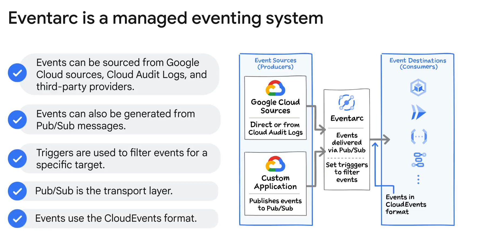

# Choreography in Google Cloud

## Overview
Choreographing services in Google Cloud can be effectively managed using services like Pub/Sub and Eventarc.

### Pub/Sub

- **Function**: Pub/Sub is a fully managed real-time messaging service that allows sending and receiving messages between independent services or applications.
- **Process**: A publisher sends a message to a Pub/Sub topic, where the message is stored and delivered to the message queue for each subscriber of the topic.
- **Subscriptions**:
  - **Pull Subscription**: Subscribers occasionally poll for messages.
  - **Push Subscription**: Messages are automatically sent to a configured endpoint.
- **Example Use Case**: 
  - An image resizing application where a Pub/Sub topic is created for image uploads. When a new image is uploaded, a Pub/Sub message is sent to the topic, and subscribers like the Resizing Service and Upload Confirm application receive the message to process it.

### Eventarc
- **Function**: Eventarc is a fully managed eventing system that simplifies building event-driven applications by supporting many Google Cloud products as event sources.
- **Sources**: Direct event generation from some Google Cloud services, Cloud Audit Logs for others, and custom application events via Pub/Sub.
- **Event Triggers**: Rules-based filters to route specific event types to specified event consumers or targets.
- **Transport Layer**: Uses Pub/Sub for reliable event delivery.
- **Standardization**: Uses the CNCF CloudEvents format for event delivery, ensuring interoperability across services, platforms, and systems.
- **Benefits**:
  - Built-in service sources for events.
  - Simplified detection of changes within services.
  - Easy rule-based interface for event handling.
  - Standardized event format for enhanced portability and productivity.

### Example
In a scenario where an image upload triggers events:
- A Cloud Storage bucket sends a Pub/Sub message upon a new image upload.
- Pub/Sub forwards the message to subscribers like the Resizing Service and the Upload Confirm application.
- Eventarc can be used to set up triggers and handle events using the standard CloudEvents format.

## Summary
Google Cloud provides robust tools like Pub/Sub and Eventarc to choreograph services effectively. These tools facilitate seamless communication between microservices, ensuring reliability, scalability, and ease of integration across different services and platforms.

