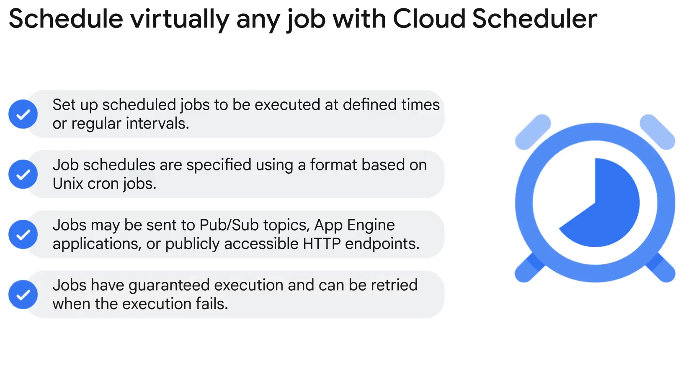
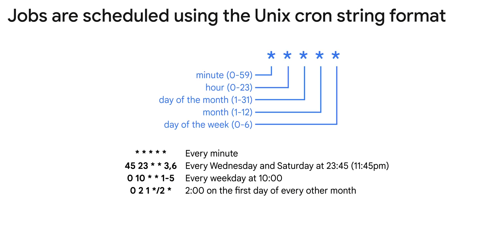
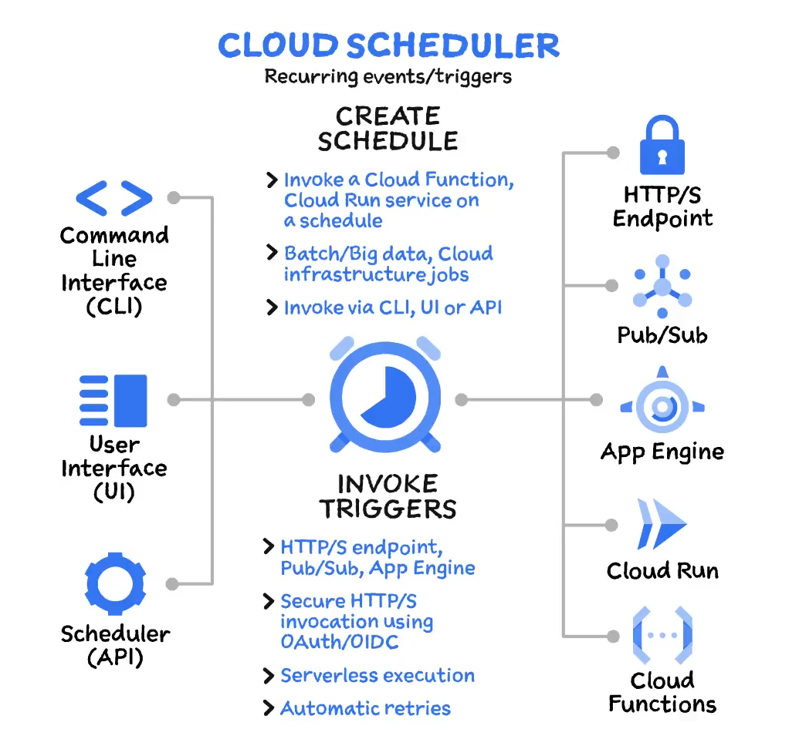
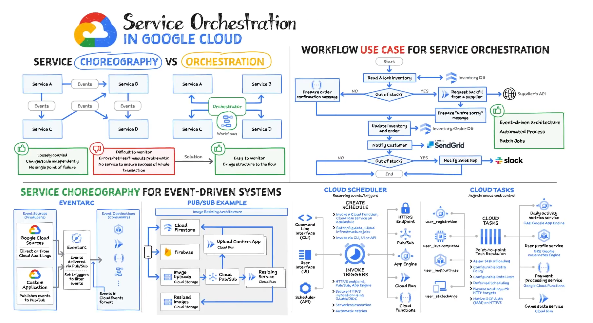

# Cloud Scheduler in Google Cloud

## Overview
Cloud Scheduler is a fully managed, enterprise-grade cron job scheduler that allows you to manage and automate the execution of jobs from a single dashboard. It supports scheduling jobs at defined intervals using the familiar Unix cron job format. Jobs can be sent to Pub/Sub topics, App Engine applications, or publicly accessible HTTP endpoints.

## Features
### Job Scheduling
- **Cron Format**: Specify jobs using the Unix cron job format, with fields for minute, hour, day of the month, month, and day of the week.
- **Time Zone Specification**: Jobs can be scheduled in specific time zones, with UTC as the default to avoid daylight saving issues.

### Execution and Retry
- **Guaranteed Execution**: Ensures that jobs are executed as scheduled.
- **Retries**: Failed job executions can be retried based on specified configurations.

### Targets
- **Endpoints**: Jobs can trigger Pub/Sub messages, App Engine applications, Cloud Functions, Cloud Run services, or any HTTP endpoints.
- **Authentication**: Attach tokens associated with a specified service account to HTTP requests for authenticated services.

### Dashboard Management
- **Single Dashboard**: Manage all scheduled jobs from a centralized dashboard, simplifying job administration and monitoring.

## Cron Job Format

The Unix cron string format consists of five space-separated fields:
1. **Minute**: 0-59
2. **Hour**: 0-23
3. **Day of the Month**: 1-31
4. **Month**: 1-12
5. **Day of the Week**: 0 (Sunday) to 6 (Saturday)

Examples:
- `15 * * * *` - Runs at the 15th minute of every hour.
- `0 0 * * *` - Runs at midnight every day.
- `0 9 1 * *` - Runs at 9 AM on the first day of every month.

Special Characters:
- **Asterisk (`*`)**: Represents the entire range of values.
- **Hyphen (`-`)**: Defines ranges (e.g., `1-5`).
- **Comma (`,`)**: Separates multiple values (e.g., `1,3,5`).
- **Slash (`/`)**: Specifies intervals (e.g., `*/2` means every two units).

## Benefits
- **Automation**: Automates routine tasks, reducing manual intervention.
- **Flexibility**: Allows for complex scheduling patterns.
- **Reliability**: Guarantees job execution with retry capabilities.

## Usage
Cloud Scheduler is ideal for:
- **Recurring Tasks**: Automating periodic tasks such as data backups, report generation, and routine maintenance.
- **Microservices Integration**: Coordinating microservices through scheduled triggers.
- **API Calls**: Making periodic API requests to external services.

## Conclusion
Cloud Scheduler is a powerful tool for automating and managing scheduled tasks in Google Cloud, providing flexibility, reliability, and ease of use through a centralized management dashboard and support for Unix cron job formatting. It integrates seamlessly with other Google Cloud services, enhancing the orchestration and choreography of microservices architectures.

