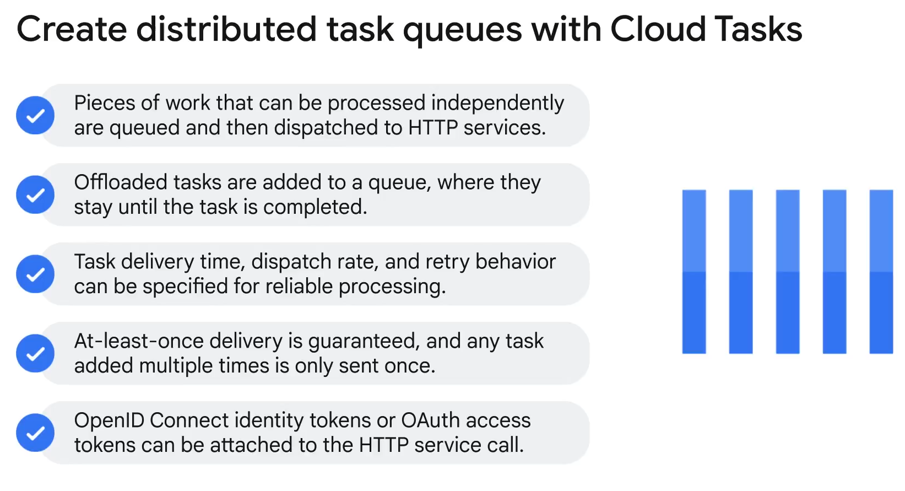
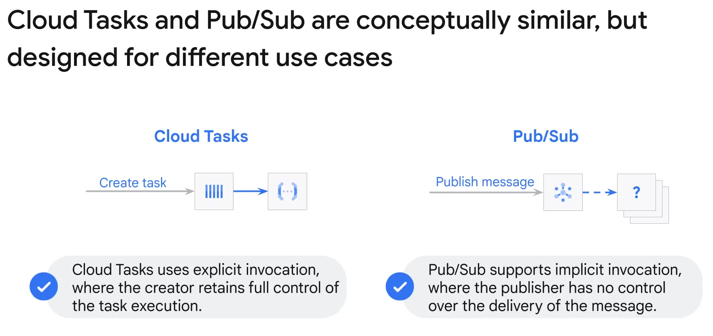
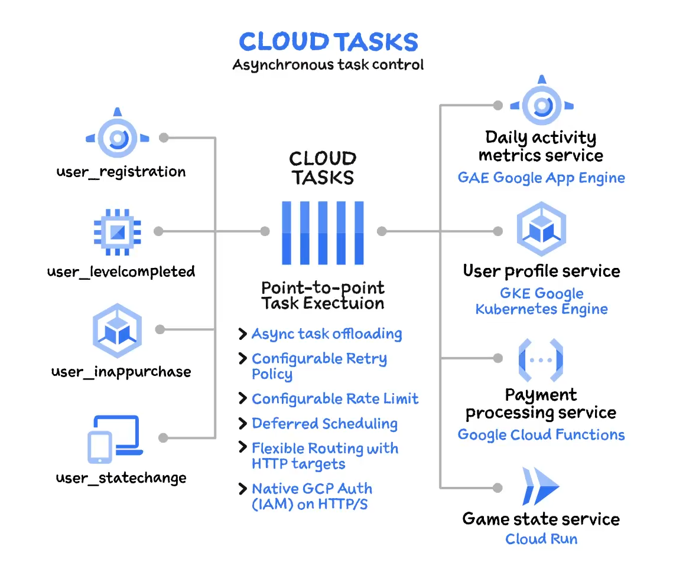

# Cloud Tasks in Google Cloud

## Overview
Cloud Tasks allows you to manage, dispatch, and deliver a large number of distributed tasks to HTTP services. Tasks are pieces of work that can be processed independently and dispatched to a chosen HTTP service. The execution status is determined by the returned status code, indicating success or the need for retries.

## Features
### Task Queues
- **Setup**: Create queues for specific services.
- **Dispatch Control**: Automatically send tasks to the specified HTTP service.
- **Status Codes**: Indicate task completion or need for retries.

### Scheduling
- **Future Dispatch**: Schedule tasks to be dispatched at a specified future time.
- **Rate Control**: Configure the maximum rate and concurrency for task dispatch.

### Retry Configuration
- **Attempts**: Set the maximum number of retry attempts.
- **Delay**: Specify delay between retry attempts.
- **Delivery Guarantee**: Ensures at-least-once delivery and eliminates duplicate tasks.

### Authentication
- **Service Account Tokens**: Automatically attach tokens for authenticated HTTP services.

## Comparison with Pub/Sub

- **Invocation Type**: Cloud Tasks uses explicit invocation with full control over execution and destination, while Pub/Sub uses implicit invocation with no control over which subscribers receive the message.
- **Use Cases**: 
  - **Cloud Tasks**: Suitable for asynchronous execution of specific services with control over timing.
  - **Pub/Sub**: Best for event-based architectures with services reacting to generated events.

## Use Cases
- **Asynchronous Execution**: Separate and process independent tasks asynchronously.
- **Background Operations**: Offload slow operations to improve main application response time.
- **Control and Configuration**: Retain control over task execution, including retries, scheduling, and rate limiting.

## Benefits
- **Efficiency**: Reduces the workload on the main application.
- **Control**: Provides detailed control over task execution and handling.
- **Flexibility**: Allows for configurable retries and rate limits to manage task processing.

## Summary
Cloud Tasks is an effective tool for managing distributed tasks in Google Cloud, providing flexibility and control over task execution. It is best suited for scenarios where specific asynchronous execution and scheduling are required, differentiating it from Pub/Sub, which is ideal for broader event-driven architectures.

