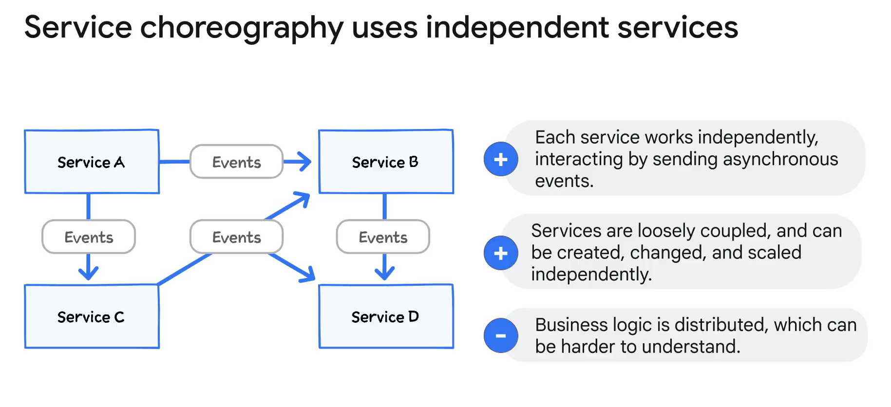
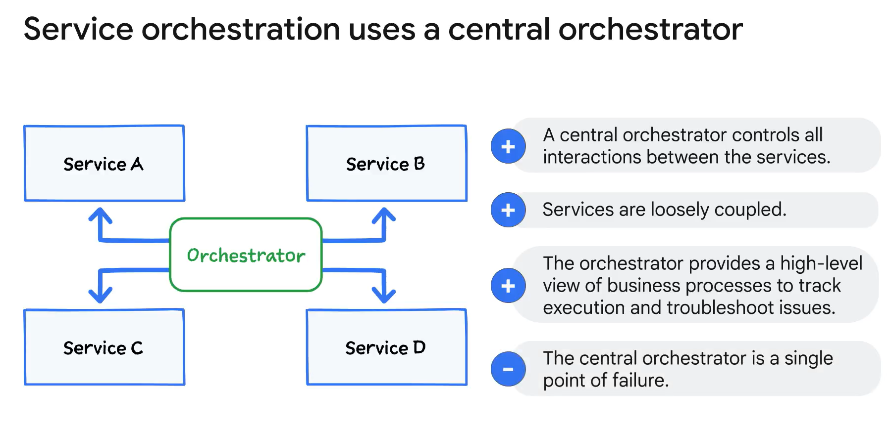

# Coordinating Microservices

## Overview
Coordinating communication between microservices in an event-driven architecture involves two primary patterns: service choreography and service orchestration. Both approaches offer distinct methods for managing the interactions between microservices.

## Service Choreography

- **Concept**: Similar to a dance performance, where each dancer performs their part independently.
- **Function**: Each service independently receives and sends events asynchronously, following defined interaction rules.
- **Advantages**: Services are loosely coupled, allowing them to be created, changed, and scaled separately.
- **Challenges**: The business logic is distributed, making the application harder to understand due to the lack of a central source of truth.

## Service Orchestration

- **Concept**: Comparable to an orchestra performance, where a conductor synchronizes the musicians.
- **Function**: A central orchestrator controls all interactions between services, with each service performing its own tasks.
- **Advantages**: Provides a high-level view of business processes, aiding in understanding, tracking execution, and troubleshooting.
- **Challenges**: The orchestrator is a single point of failure; if it fails, the entire orchestration process cannot run.

## Summary
Both service choreography and orchestration provide methods to manage the communication between microservices, each with its own set of advantages and challenges. Choosing the right approach depends on the specific requirements and constraints of your application.