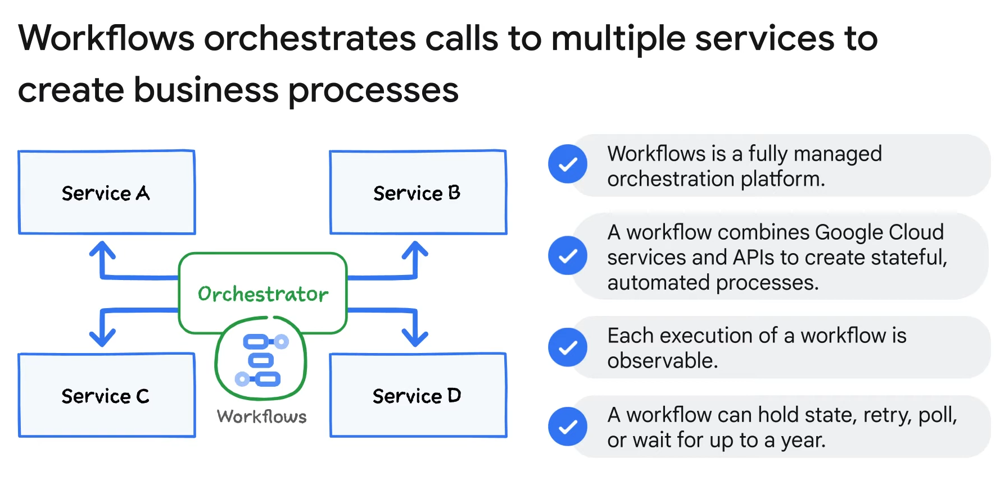
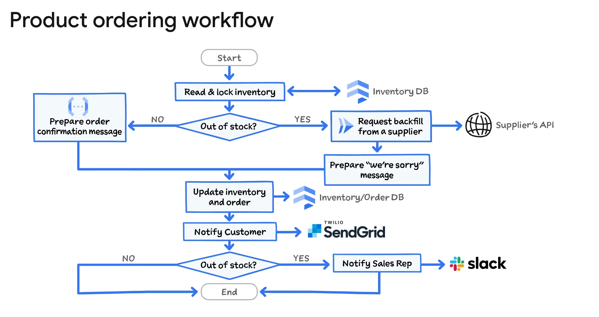
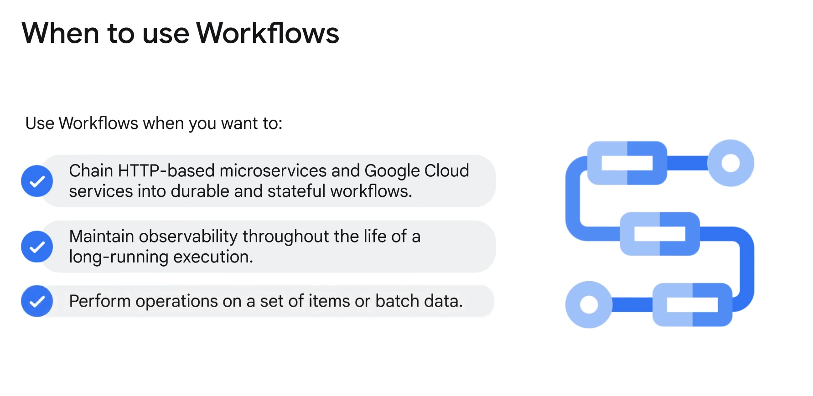

# Orchestration in Google Cloud

## Overview
Google Cloud's Workflows platform is a fully managed orchestration service used to implement the service orchestration pattern. It serves as the central orchestrator, managing Google Cloud services and API calls to build stateful, automated processes. 

### Key Features
- **Central Source of Truth**: Provides a single point of reference for the application flow.
- **Logging and Observability**: Every execution is logged, making it easier to track and troubleshoot.
- **Flexibility**: Can hold state, retry, poll, or wait for up to a year, supporting long-running business processes.

### Example Workflow

A product ordering workflow is detailed:
1. **Check Inventory**: Verifies product availability in Firestore.
2. **Conditional Paths**: Depending on stock availability:
   - **In Stock**: Lock items and prepare order confirmation via a Cloud Function.
   - **Out of Stock**: Trigger a Cloud Run service to request inventory and prepare a "sorry" message.
3. **Update Records**: Updates inventory and order details in Firestore.
4. **Customer Notification**: Sends an email to the customer indicating order status.
5. **Sales Notification**: Posts a Slack message if items are out of stock.

### Benefits
- **Durable and Stateful Workflows**: Ideal for chaining HTTP-based microservices.
- **Long-running Processes**: Supports extensive operations with robust error handling.
- **Batch Processing**: Efficient for operations on multiple items or batch data.

## Use Cases

- **Chaining Microservices**: For complex, stateful workflows involving multiple services.
- **Batch Operations**: Handling multiple items with guarantees on error management and retry mechanisms.
- **Long-running Processes**: Managing workflows that require extended operation times with detailed logging and observability.

## Summary
Google Cloud's Workflows platform offers a comprehensive solution for orchestrating microservices, providing stateful, durable, and observable workflows that improve the reliability and manageability of complex applications. It is well-suited for applications requiring extensive error handling, batch processing, and long-running operations.