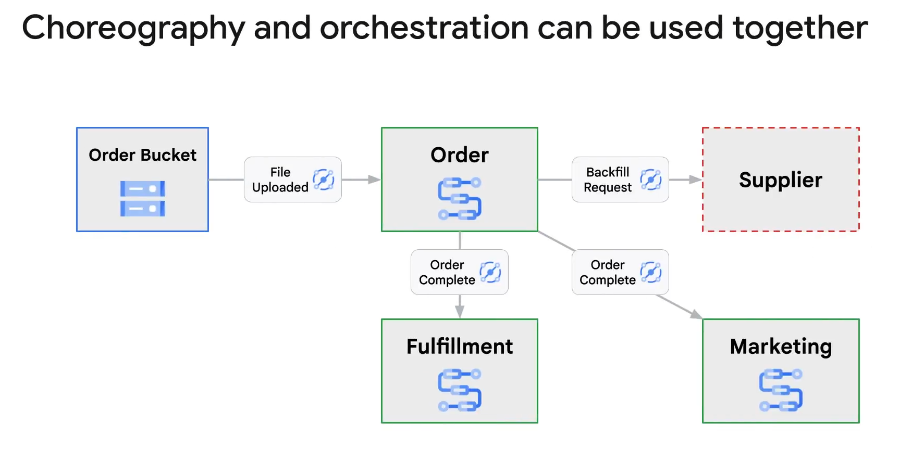

# Should I Use Choreography or Orchestration?

## Introduction
Deciding between choreography and orchestration for coordinating microservices in Google Cloud depends on various factors. Each approach has its own advantages and challenges.

## Choreography

### Characteristics
- **Event-Based**: Services rely on receiving events to trigger actions.
- **Decentralized Control**: Each service is responsible for its own actions based on events.
- **Decoupling**: Producers of events do not need to know the consumers.

### Example
Service A sends an event to Pub/Sub. Service B receives and processes this event without direct knowledge of Service A.

### Advantages
- **Loose Coupling**: Services operate independently.
- **Scalability**: Easier to scale individual services.
- **Flexibility**: New services can be added without modifying existing ones.

### Challenges
- **Complexity in Visibility and Error Handling**: Difficult to track the flow and manage errors across distributed services.
- **Reliability**: Ensuring successful processing and delivery of events can be challenging.

## Orchestration
### Characteristics
- **Centralized Control**: A central orchestrator manages the sequence of service interactions.
- **Visibility**: Provides a clear view of the workflow and state of each process.
- **Error Handling**: Centralized management allows for robust error handling and retries.

### Example
A workflow in Google Cloud's Workflows platform orchestrates the process of ordering, checking inventory, and notifying customers.

### Advantages
- **Centralized Management**: Easier to manage and monitor complex workflows.
- **Reliability**: Improved error handling and retries.
- **Observability**: Enhanced visibility into process states and execution.

### Challenges
- **Single Point of Failure**: The orchestrator becomes a critical component.
- **Shared Management**: Difficult when services are managed by different teams or organizations.

## Choosing the Right Pattern
### When to Use Choreography
- **Decentralized Services**: When services are managed by different teams or need to be highly independent.
- **Event-Driven Needs**: When leveraging events from various Google Cloud services.

### When to Use Orchestration
- **Complex Processes**: When you need to manage and control complex workflows centrally.
- **Reliability and Visibility**: When error handling, retries, and observability are critical.

## Hybrid Approach
Combining both patterns can offer the best of both worlds. For instance, using Workflows for central orchestration and Eventarc for event-driven communication between services can provide robust error handling and visibility while maintaining flexibility.

### Example Hybrid Workflow
- **Workflows**: Orchestrates Order, Fulfillment, and Marketing services.
- **Eventarc**: Triggers events for inter-service communication and detects new order files in Cloud Storage.

## Conclusion
Choosing between choreography and orchestration depends on the specific requirements and structure of your application. Orchestration provides control and reliability for complex workflows, while choreography offers flexibility and scalability for decentralized services. Combining both can optimize the strengths of each pattern for a robust microservices architecture.