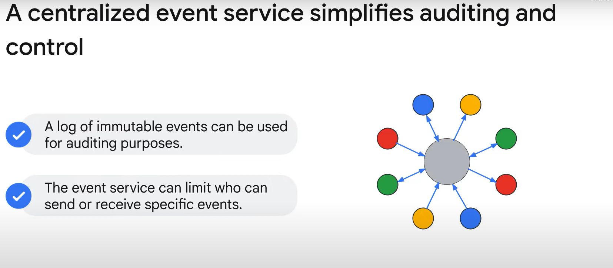
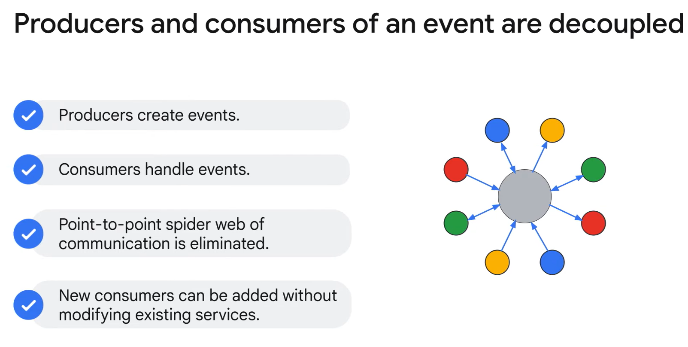

# Benefits of Event-Driven Applications

Event-driven applications offer numerous advantages that enhance the efficiency and resilience of distributed systems. Here are the key benefits:

### Simplified Auditing and Control
- **Centralized Event Service**: Provides a log of immutable events useful for auditing purposes, offering a timed, ordered record of every change in the application's state.

- **Access Control**: Centralized control of access to services and data through authentication and authorization at the event service.

### Decoupling of Services

- **Decoupled Communication**: Producers and consumers of events do not need to know each other's details, reducing the complexity of point-to-point communication.
- **Scalability**: New event consumers can be added without modifying existing services.

### Resilience and Asynchronous Processing
- **Resilient Architecture**: Events are generated asynchronously, allowing the system to handle the temporary loss of a service. Events can be replayed or redelivered when the service is back online.
- **Asynchronous Handling**: Leads to more resilient applications, as services do not have to wait for immediate responses.

### Efficient Messaging
- **Push-Based Messaging**: Clients receive updates without continuous polling, reducing network I/O and unnecessary processing delays.

Event-driven architecture's decoupling and asynchronous processing capabilities lead to more maintainable, scalable, and resilient applications, simplifying the overall system design and operation.

By understanding and leveraging these benefits, developers can create robust applications that efficiently handle events and maintain high performance and reliability.