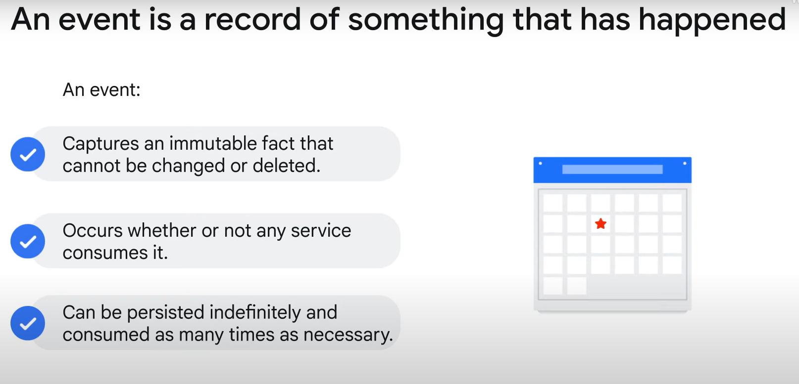
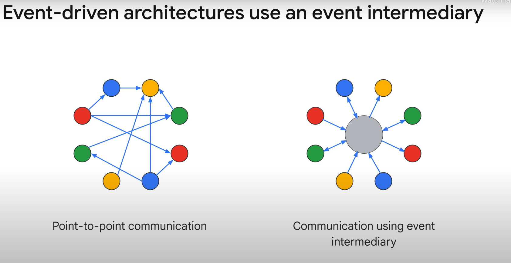

### Event-driven Architecture

**Introduction to Event-driven Architecture:**
- Event-driven architecture is beneficial for applications built using microservices. It helps in decoupling the services and managing communication efficiently.

**Understanding Events:**
- **Definition:** An event is a record of something that has happened. Examples include an employee logging into an application or a product being added to a shopping cart.
- **Attributes of Events:**
  1. **Immutable Fact:** Events are treated as immutable facts. They are historical records of occurrences and should not be modified or deleted.
  2. **Generated but Unconsumed:** Events can be generated even if they are never consumed. The producing application may not know whether the events are consumed.
  3. **Indefinite Persistence:** Events can be persisted indefinitely and consumed multiple times by various services. This allows for parallel processing.

**Challenges with Point-to-Point Communication:**
- Point-to-point communication between microservices creates a "spider web" of connections.
- Each service must know how to communicate with all downstream services, introducing coupling between microservices.

**Event Intermediary:**

- An event-driven architecture inserts an event intermediary between services.
- **Event Producer:** A service that generates events sends them to the intermediary. The producer does not need to know about the consuming services.
- **Event Consumer:** A service that consumes events receives them from the intermediary. Consumers handle events without needing details about the producers.

**Benefits of Event-driven Architecture:**
1. **Decoupling Services:** By using an event intermediary, services are decoupled. Producers and consumers do not need to know about each other.
2. **Parallel Processing:** A single event can be processed by multiple services in parallel, enhancing the efficiency and scalability of the application.
3. **Flexibility:** It provides flexibility in managing and scaling different parts of the application independently.
4. **Improved Maintenance:** Reduces the complexity of the system, making it easier to maintain and update individual services without affecting others.

**Conclusion:**
- Event-driven architecture simplifies communication between microservices by introducing an event intermediary. This architecture helps in decoupling services, allowing for more manageable, scalable, and flexible applications. Understanding the nature of events and their role in this architecture is crucial for leveraging the full benefits of microservices.